# Making, Adjusting, and Adding a Stop to a Reservation (Screenshots)

**SOP:** SOP-004

**Audience:** Ordinary staff dispatchers

**Last updated:** August 24, 2026

This is a picture-by-picture walkthrough of the three things dispatchers do most:
book a new reservation, change something on one that already exists, and add an
extra stop to a trip. It's the "show me" companion to
[SOP-002, the Dispatcher Operations Handbook](dispatcher-operations-handbook.md) —
read that one for the full rules and edge cases; use this one when you just want
to see where the buttons are.

Every screenshot below is a real walkthrough done in a test copy of the system,
not a mockup. The gold boxes point at what to click or type next.

## Part 1 — Book a new reservation

**1. From the dashboard, click New Reservation.**

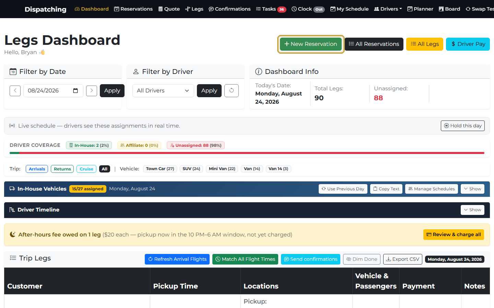

**2. Pick the trip type.** Most trips are One-Way or Round Trip. Click Next.

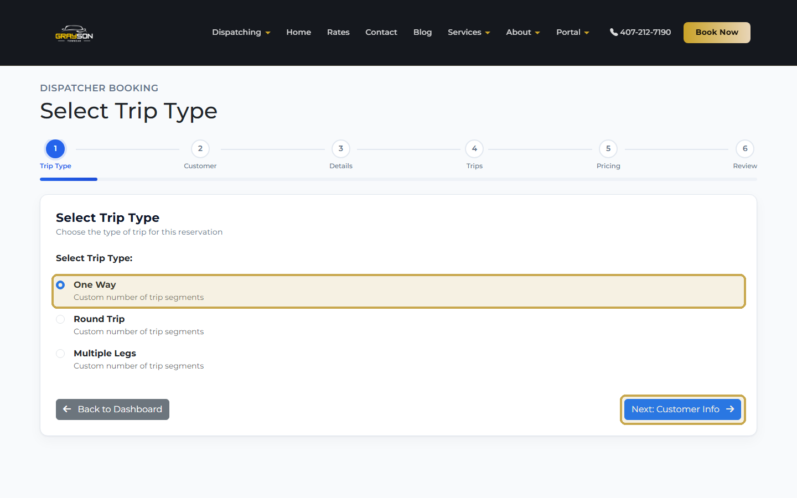

**3. Enter the customer.** Type their name, email, and phone. If they've booked
with us before, try Quick Customer Lookup first — it auto-fills everything from
their last reservation instead of you retyping it.

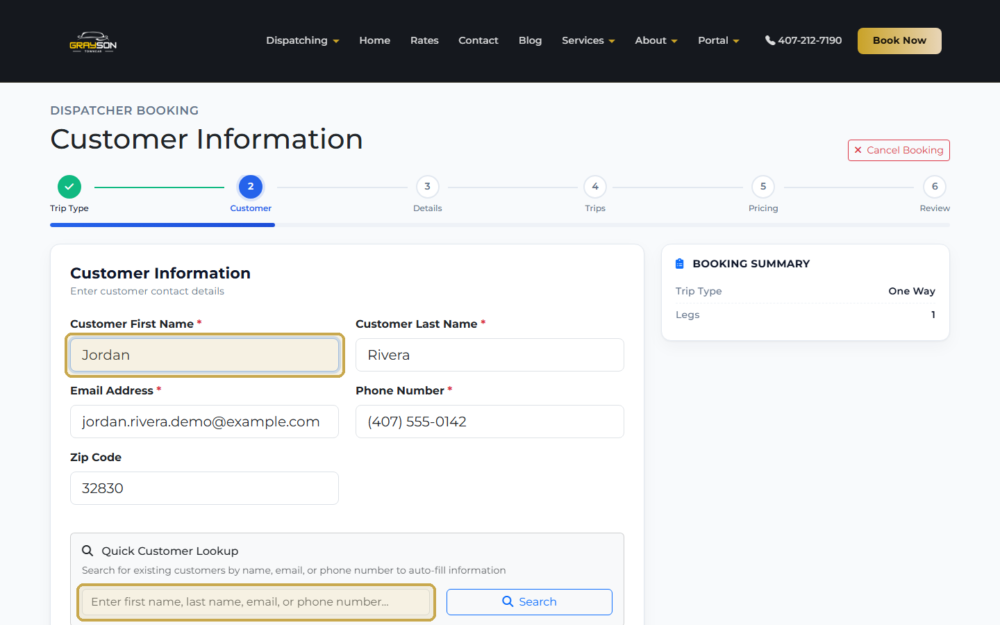

**4. Set passengers, luggage, and the vehicle.** Car seats and a grocery/store
stop are also set here if the customer needs them.

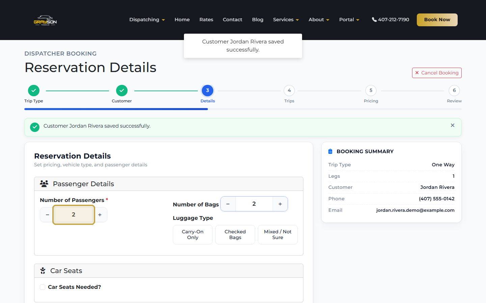

**5. Fill in the trip itself** — date, time, pickup address, and drop-off
address. Flight info is optional and only matters for airport pickups.

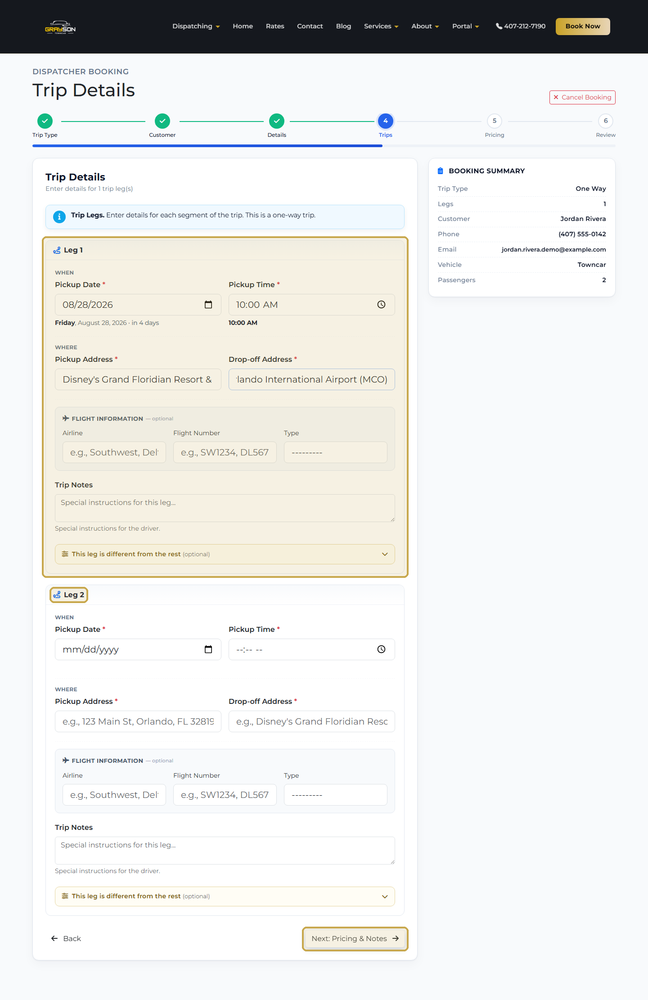

> **Heads up:** for a one-way trip you'll see an empty **Leg 2** card underneath
> Leg 1. That's normal — leave it blank and click Next. It's only there in case
> you need to add a second leg on the fly.

**6. Set the price.** Enter the base price yourself — the suggested rate (if one
shows) is a reference, not a rule. The 20% button auto-fills gratuity from the
base price; use Custom for anything else.

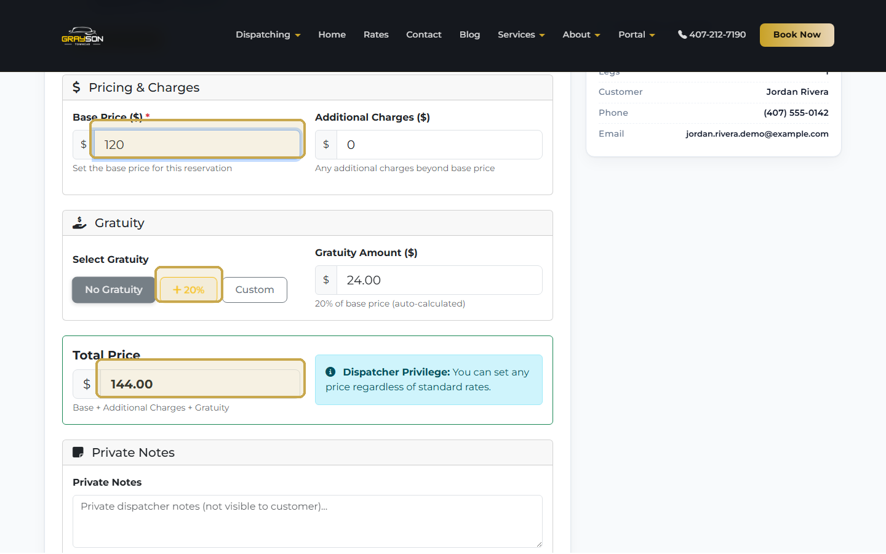

**7. Review everything, then click Create Reservation.** You'll get a
confirmation popup first — check the customer name, price, and leg count before
confirming. This can't be undone.

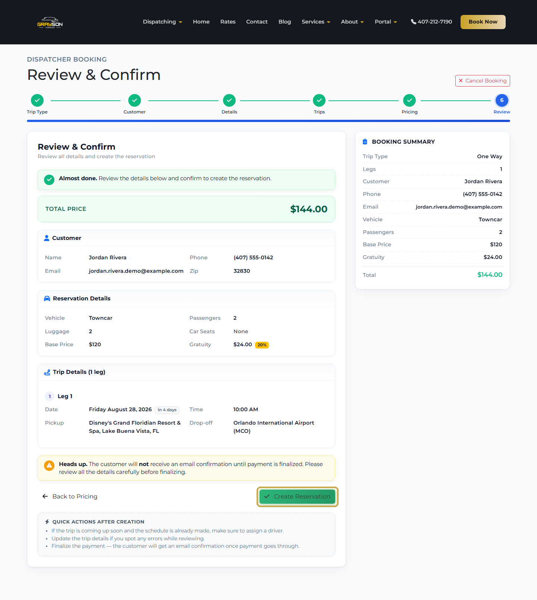

**8. Done.** The reservation opens on its detail page. This is also where
you'll come back to for everything in Parts 2 and 3 below — **Edit Reservation**
changes the trip, **Stops & flights** manages extra stops and flight info.

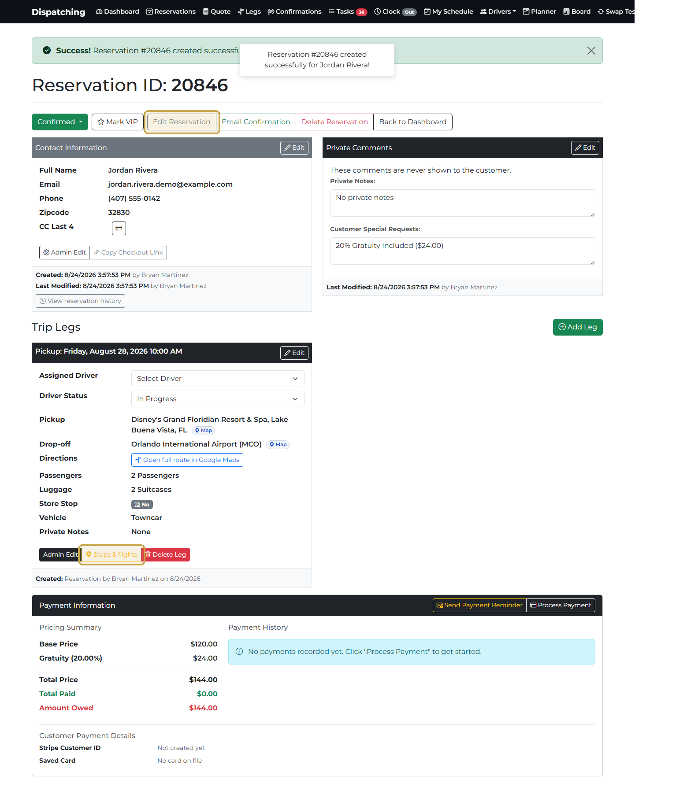

## Part 2 — Adjust a reservation that already exists

Say the guest calls and asks to push pickup back an hour, and wants a callback
reminder noted. Open the reservation and click **Edit Reservation**.

**1. Customer-facing notes live on the Reservation tab**, in Special Requests.

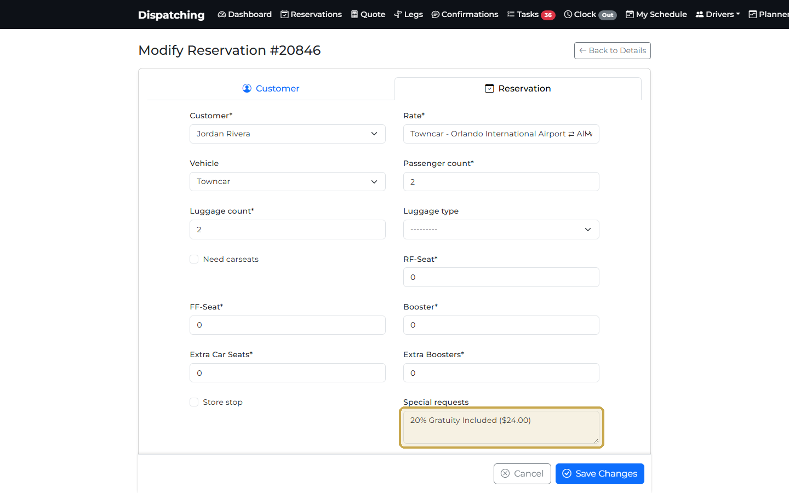

**2. The actual trip time is a separate field, further down the same page**
under Trip Legs — it's not inside the tabs. Change the time there.

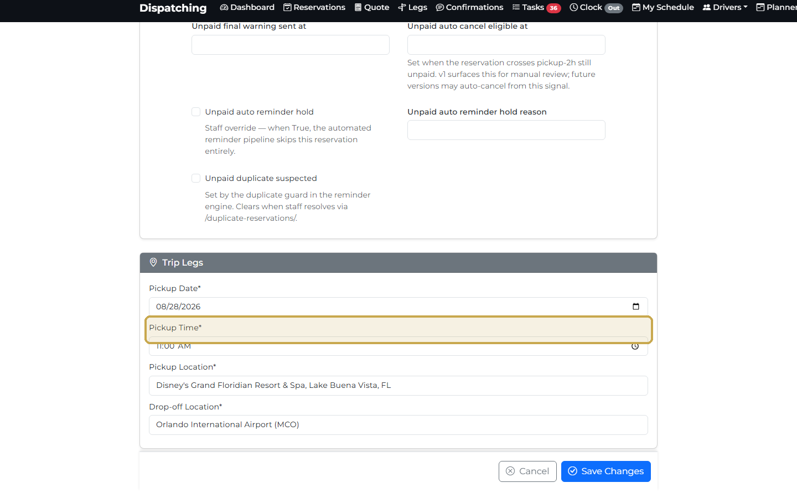

**3. Click Save Changes, then reopen the reservation and check both fields
actually changed.** Don't assume — verify.

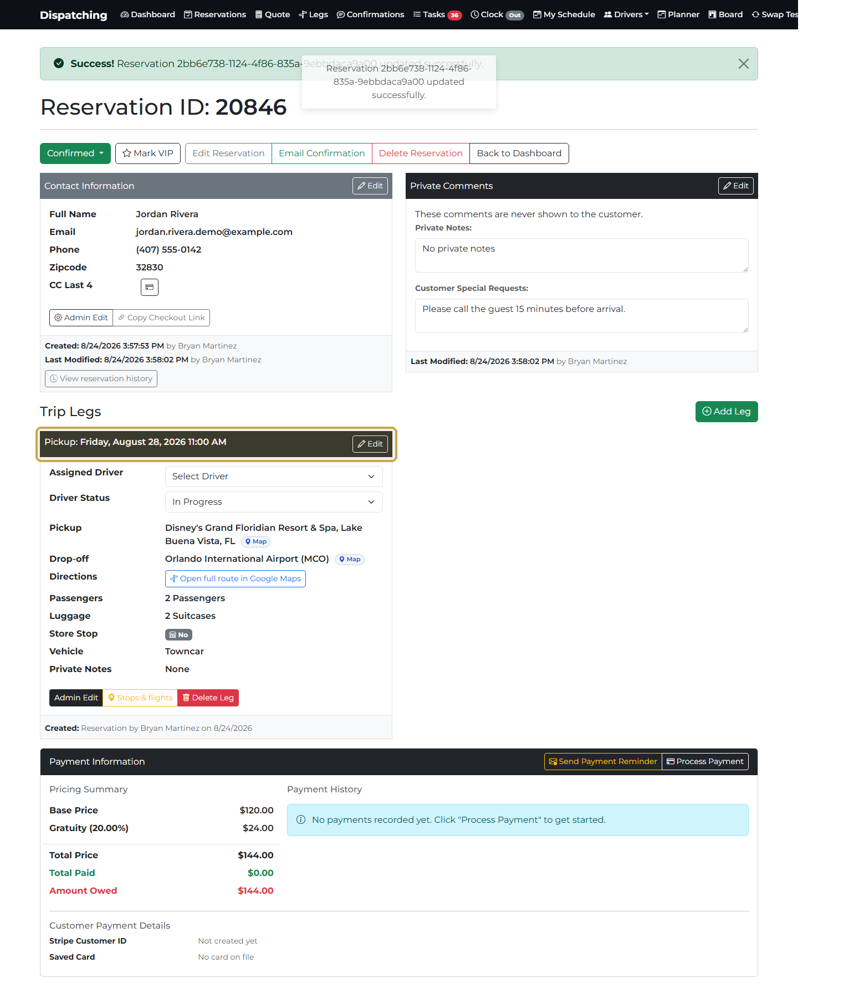

## Part 3 — Add an extra stop

Use this when a trip needs a quick stop along the way — a pharmacy, a bag drop,
an extra pickup — that isn't the main pickup or drop-off.

**1. On the reservation detail page, click Stops & flights on the leg that
needs the stop.** A window opens showing the primary drop-off and an **Add a
stop or drop-off** card.

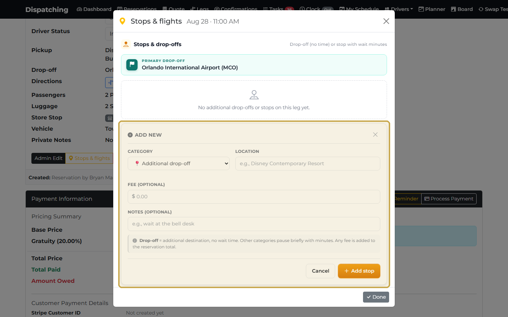

**2. Pick a category, enter the location, and set wait minutes.** A fee is
optional — add one only if this stop should change the reservation total.

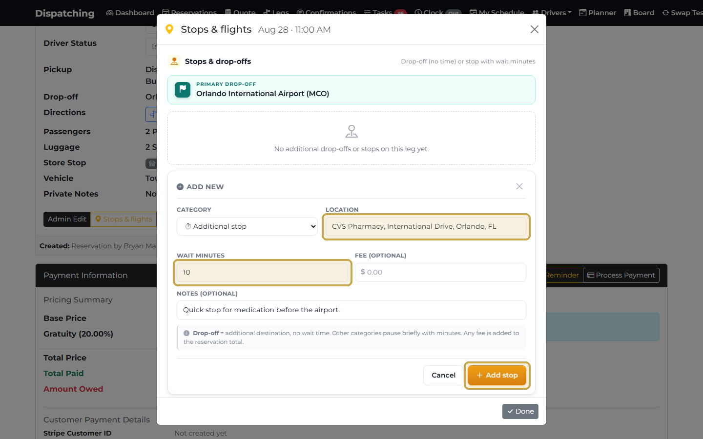

**3. Click Add stop.** It appears in the list immediately inside this window.

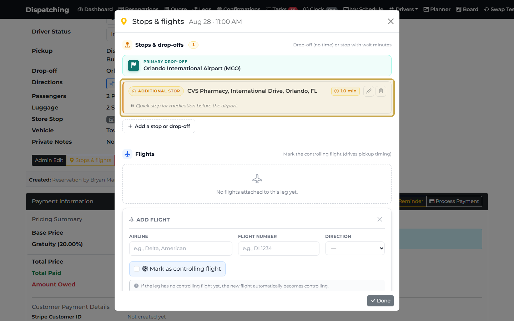

**4. Close the window and refresh the page.** The main reservation page doesn't
update live — reload it (or reopen the reservation) to see the stop show up
between Pickup and Drop-off, and the button now reads how many stops the leg has.

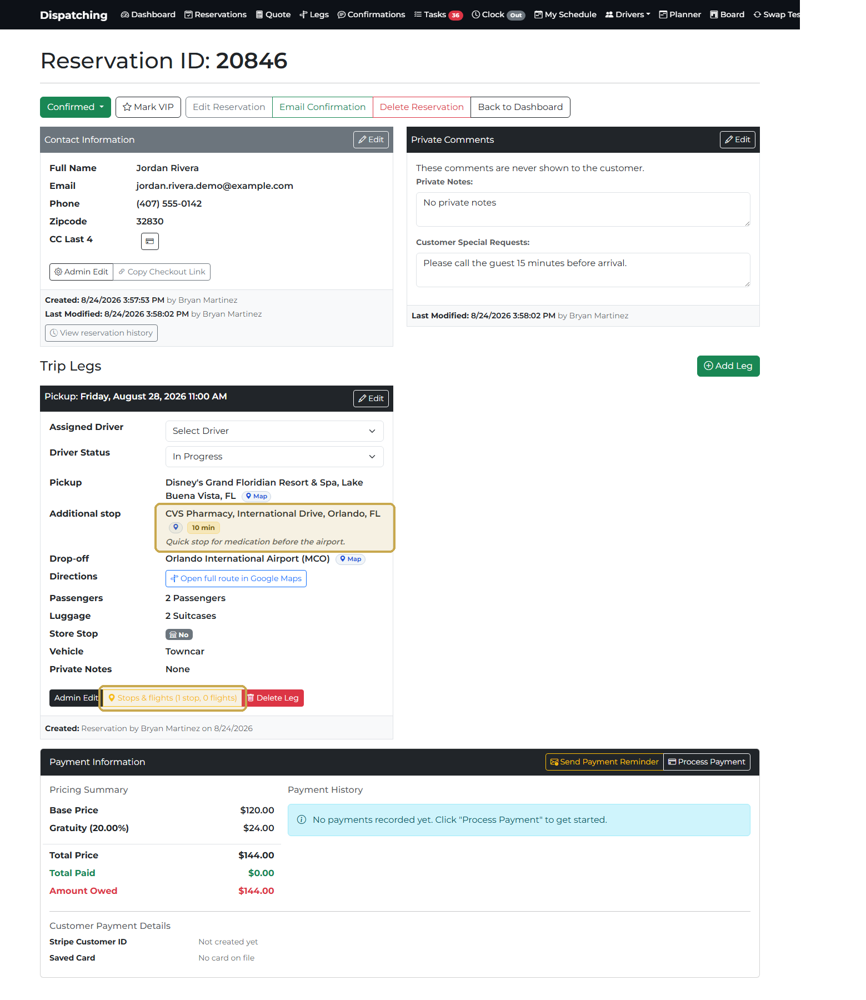

---

For everything not covered here — modifying prices after the fact, cancelling
legs, flights, driver assignment, and what to do when something goes wrong —
see [SOP-002, the Dispatcher Operations Handbook](dispatcher-operations-handbook.md).
