# SOP-005: Working the Tasks System (Ops Control)

**SOP:** SOP-005

**Audience:** All dispatchers and office staff

**Last updated:** October 2, 2026

Ops Control — the **Tasks** link in the top menu — is the team's shared work list. About every 30 minutes, the system files a task for anything that needs a person: a driver who can't make a pickup, a trip with no driver, an unpaid booking, a moved flight. One dispatcher claims each task, fixes the real problem, and closes it. Nothing in Tasks texts, calls or moves a driver on its own. This guide shows the screen, its buttons and all 11 kinds of task, each with a picture.

**The #1 rule: fix the trip, not the task.** Assign the driver, take the payment, correct the flight — most tasks then close themselves, instantly or at the next 30-minute check. Press **Complete** only when the problem is handled, or when you have checked and the board is right as it stands. Say which in the note.

The pictures use made-up guests and drivers. To retake them after the screens change, see `scripts/sop_flow_tasks.py`.

## Who does what

Ops Control is for office staff only; chauffeurs never see it.

| Who | Their part |
| --- | --- |
| The system, about every 30 minutes | Files new tasks, closes tasks whose problem has gone away, and brings snoozed tasks back. It never texts, calls, reassigns or charges anyone. |
| Dispatcher on shift | Claims tasks, fixes the trip, logs every call, text and email on the task, and closes it with a note. Creates a manual task for any follow-up the system doesn't catch. |
| Next dispatcher | Picks up whatever the last shift released or assigned to them by name. |
| Founders | Use **Admin Tasks** (under Admin) to assign, complete or cancel many tasks at once. Take the handoffs nobody on shift can decide: refunds, disputes, staffing. |

## Ops Control at a glance

Open it from **Tasks** in the top menu. It always opens on the **Unclaimed** lane.

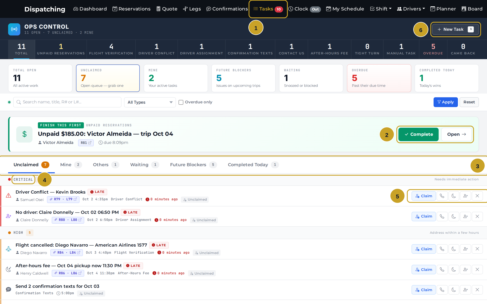

1. **Tasks** in the top menu. The red number counts open tasks for the whole team, not just yours, and updates when a page loads.
2. **Next up** is the one task to do now: your most urgent claimed task ("Finish this first"), or else the most urgent unclaimed one. Complete or open it right here.
3. **The lanes**: Unclaimed (nobody owns it yet), Mine, Others (a teammate's), Waiting (snoozed), Future Blockers (problems on trips after today) and Completed Today. Keys **1–5** jump between them.
4. **Priority bands**: Critical means act now, High means within a few hours, then Medium (today) and Low (when there's time). A Critical task is due the moment it's filed, so it shows **LATE** straight away.
5. **The buttons on each row** — see the next section.
6. **New Task** (or press **N**) for a follow-up the system doesn't catch.

Good to know:

- Within a band, rows are in due-time order, not pickup order. Check each row's pickup time.
- Driver Conflicts for tomorrow and later fold under **Tomorrow and later** at the bottom, including Critical ones for tomorrow. Open it every shift.
- Search takes a first **or** last name, a title, or the R-number on the blue chip — not the booking number guests see.

## The buttons on every task

Every row has the same buttons on its right. On a task nobody owns, the first one is **Claim**: press it before you start, so nobody doubles up.

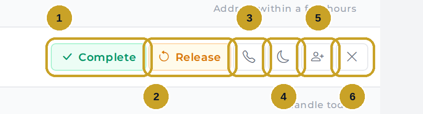

1. **Complete** — the problem is handled. Write a note when the box asks for one.
2. **Release** — hand it back to Unclaimed.
3. **Phone** — log a call, text or email.
4. **Moon** — snooze it for 1 hour, 4 hours, or until 9 AM tomorrow.
5. **Person** — give it to a named teammate. Tell them.
6. **X (Dismiss)** — only for a task that is wrong. No name or reason is saved.

Snooze, Release and Dismiss live only here on the row, not on the task pages.

Log every attempt, even a voicemail or a no-answer. Pick the channel and the outcome, add the number or email you used and a short note, then press **Log**:

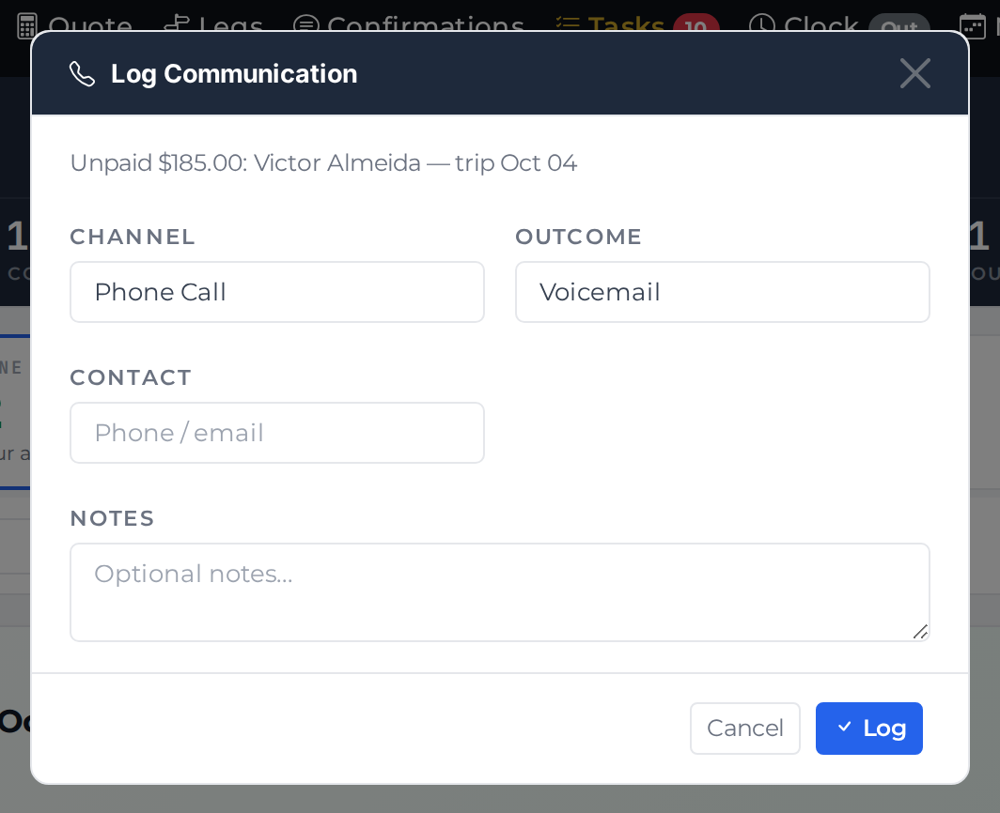

### Working any task

1. Start with **Mine**, then Unclaimed from the top, Critical first.
2. Open the task by clicking its title. Open the trip with the blue R-number chip; it opens in a new tab.
3. **Claim** it.
4. Fix the trip. Each task's own section below says how.
5. Log every contact attempt.
6. Close it the right way: see [Closing a task](#closing-a-task).

## How a task moves

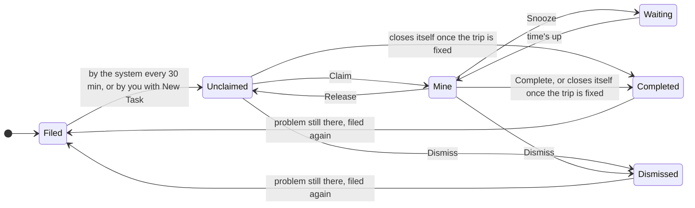
```mermaid
stateDiagram-v2
    direction LR
    [*] --> Filed
    Filed --> Unclaimed: by the system every 30 min, or by you with New Task
    Unclaimed --> Mine: Claim
    Mine --> Unclaimed: Release
    Mine --> Waiting: Snooze
    Waiting --> Mine: time's up
    Unclaimed --> Completed: closes itself once the trip is fixed
    Mine --> Completed: Complete, or closes itself once the trip is fixed
    Unclaimed --> Dismissed: Dismiss
    Mine --> Dismissed: Dismiss
    Completed --> Filed: problem still there, filed again
    Dismissed --> Filed: problem still there, filed again
```

Snoozed tasks come back on their own. A closed task is filed again only if the problem is still there; [Closing a task](#closing-a-task) says when.

## Closing a task

Pick the button by what actually happened.

| What happened | Press | What happens next |
| --- | --- | --- |
| You fixed the trip | Usually nothing: most tasks close themselves once the trip is right. If it's still open, **Complete** and say what you did. | Done. |
| You checked, and the board is right as it stands | **Complete**, with a note saying why you're leaving it | A Driver Conflict or flight-mismatch task stays closed for up to 3 days, unless a time, the driver, the flight or the lateness changes. Completing a Driver Conflict also takes its red flag off the board. |
| You're waiting on someone | Log the attempt, then **Snooze**: 1 hour, 4 hours or 9 AM tomorrow | It sits in Waiting, then comes back to whoever owned it, or to Unclaimed. Allow up to 30 minutes past the time. |
| You can't keep it | **Release**, or give it to a named teammate | It stays open, with nothing lost. |
| The task is wrong: a test, a duplicate, spam | **Dismiss** (the X) | It's marked cancelled, with no name or reason saved. If the system still sees the problem, it files it again about 2 hours later. |

When you press **Complete** on a row, it asks for a note. Say what you did:

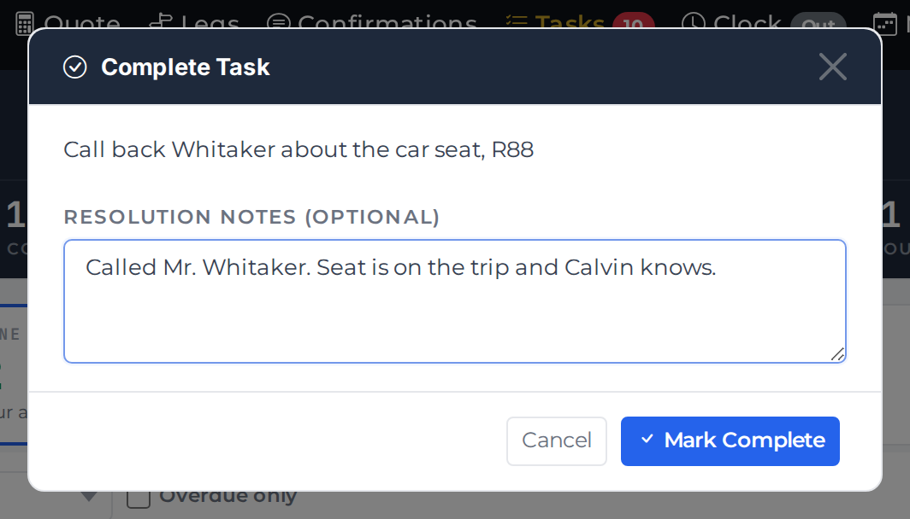

Three rules that catch people out:

- **Complete does not fix anything.** An unpaid booking, a trip with no driver or an uncontacted form comes back about 2 hours after you close it, for as long as the problem is still there.
- **Your note only saves from the row.** **Mark resolved** on a Driver Conflict page saves no note, and Complete on an Unpaid page saves a stock one. If the reason matters, Complete it from the row.
- **An After-Hours Fee task can't be closed blank.** Complete on its row asks the money question instead; see [After-Hours Fee](#10-after-hours-fee).

## Every task, one by one

There are 11 kinds of task. Each one below has the same parts: what it means, its screen with numbered callouts, the steps, and what makes it close on its own.

| Task | What it means | Priority |
| --- | --- | --- |
| [Driver Conflict](#1-driver-conflict) | A driver can't reach his next pickup in time | Critical, or High if 3+ days out |
| [Driver Assignment ("No driver")](#2-driver-assignment-no-driver) | A trip today has nobody on it | Critical |
| [Unpaid Reservations](#3-unpaid-reservations) | A guest hasn't paid and the trip is within 3 days | Medium to Critical as the trip nears |
| [Flight mismatch](#4-flight-mismatch) | An arrival flight moved 30+ minutes | Low to High |
| [Flight not found](#5-flight-not-found) | The flight number can't be found | High |
| [Flight cancelled or diverted](#6-flight-cancelled-or-diverted) | The guest's flight isn't arriving as booked | High |
| [Overnight date](#7-overnight-date) | An after-midnight pickup: which night does the guest land? | Medium |
| [Confirmation Texts](#8-confirmation-texts) | Tomorrow's confirmation texts haven't gone out | High, due 5 PM |
| [Contact Us](#9-contact-us) | Someone wrote in through the website | High |
| [After-Hours Fee](#10-after-hours-fee) | A pickup between 10 PM and 6 AM without the $20 | High |
| [Manual Task](#11-manual-task) | A follow-up a person (or the system) wrote down | Whatever was set |

No longer filed: Tight Turn, QUOTE NEEDED and Possible duplicate.

### 1. Driver Conflict

A driver is booked on two jobs he can't make back to back. For an airport arrival, "in time" means inside the terminal by the flight's gate time + 10 minutes.

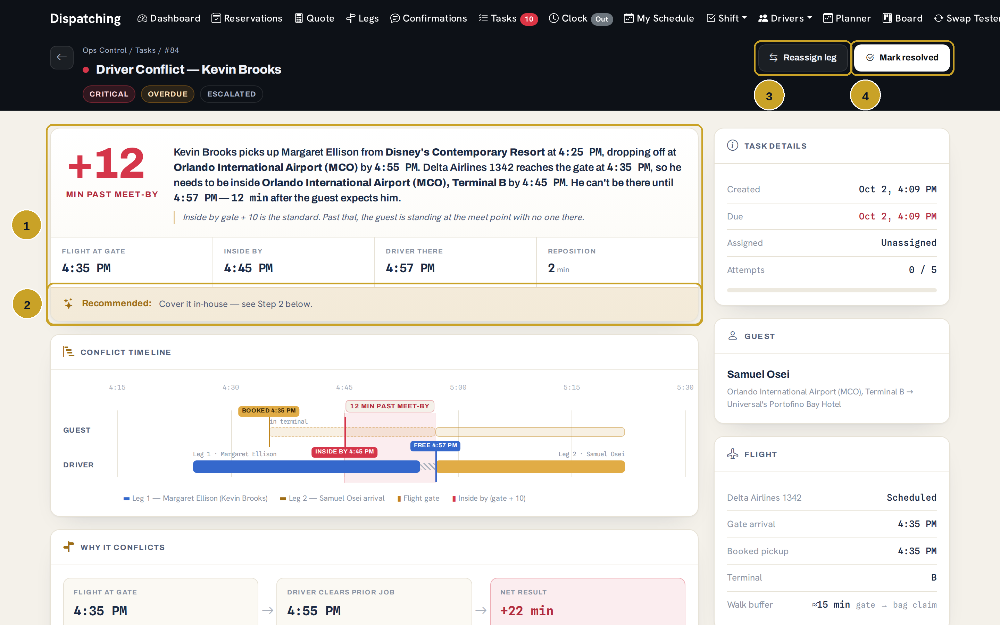

1. **The headline** says who, which two jobs, and how many minutes past the deadline he'll be.
2. **Recommended** names the fix to start with.
3. **Reassign leg** opens the dispatch board on this trip.
4. **Mark resolved** closes the task. It saves no note.

Further down the page is the **Resolution Ladder**:

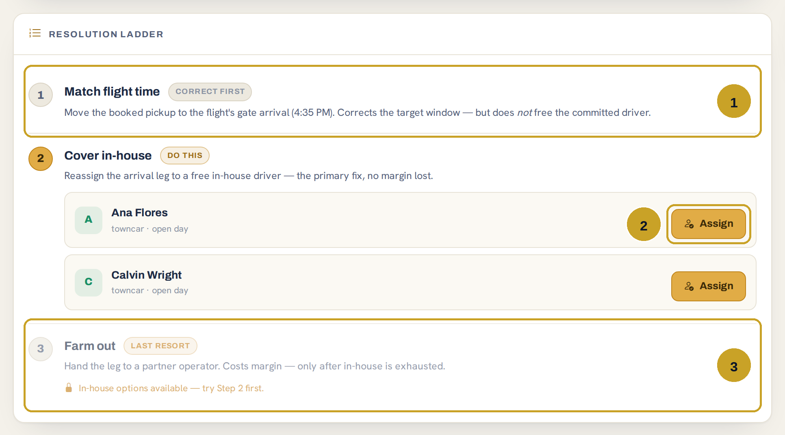

1. **Match flight time** moves the booked pickup to the flight's gate time. It fixes the target, but doesn't free the driver. On a non-airport trip this step is **Monitor the prior job**, with a Call button.
2. **Cover in-house** is the main fix: press **Assign** next to a free driver. Only drivers rostered today with a suitable car are offered.
3. **Farm out** hands the trip to a partner. It costs margin, so it stays locked while an in-house driver fits.

**Do this:** read the headline, then work down the ladder. Call or text the driver if he needs to know; nothing automated contacts drivers. If the board is right as it stands, press Mark resolved: the task stays closed for up to 3 days unless something changes, and the red flag comes off the board.

**Closes itself when** the driver changes, either trip is finished or cancelled, or the next check finds no conflict.

**Watch out:** the ESCALATED tag only means time has passed; nobody is paged.

### 2. Driver Assignment ("No driver")

A trip today has nobody on it, and its pickup hasn't passed. It is always Critical.

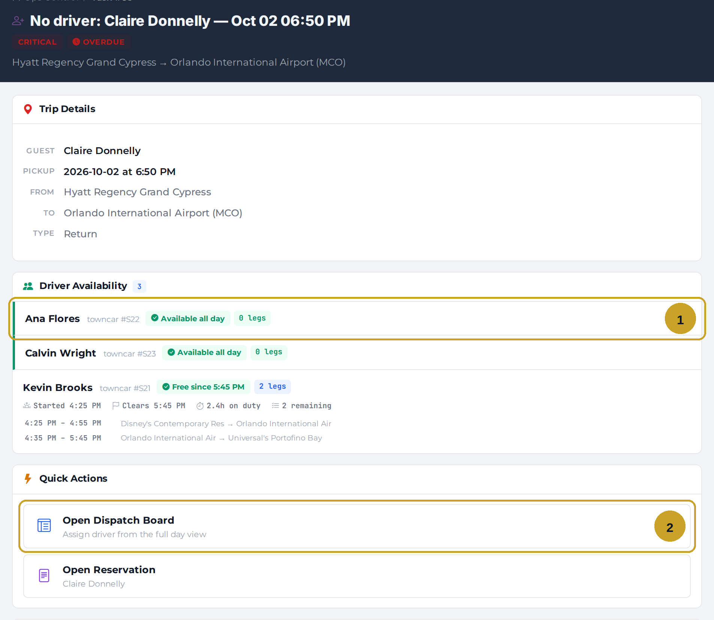

1. **Driver Availability** lists who is rostered today and how busy they are. "Available all day" in green means free.
2. **Open Dispatch Board** is where you assign. The task page itself has no assign button.

**Do this:** pick a free driver from the list, open the dispatch board, and assign them to the trip. If nobody fits, farm it out.

**Closes itself when** a driver is assigned (straight away), or the pickup time passes.

### 3. Unpaid Reservations

A confirmed booking with no payment at all, a trip within 3 days, and booked more than 12 hours ago. A saved card counts as paid. It is Medium 3 days out, High 1–2 days out and Critical on the day. The system also emails these guests on its own, so check what they've had before you call.

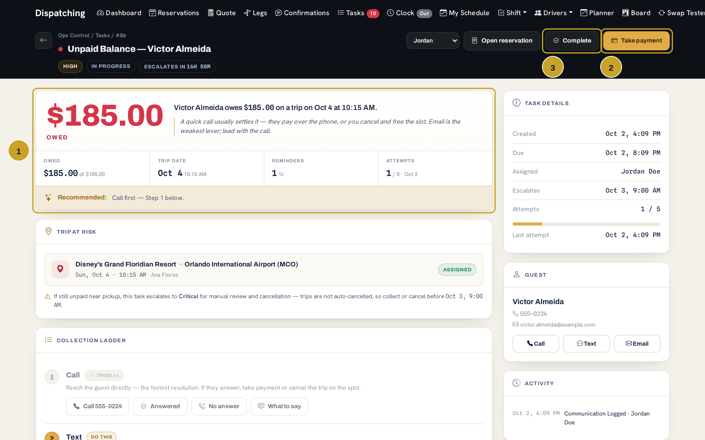

1. **The balance**, with the trip date, reminders already sent and attempts so far.
2. **Take payment** opens the payment page for this booking.
3. **Complete**, only once it's paid or the trip is cancelled.

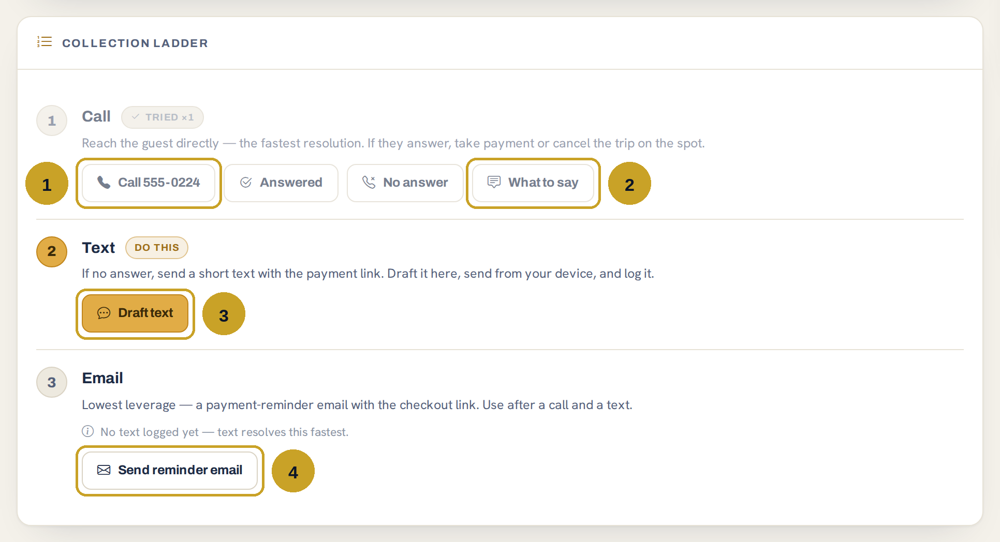

1. **Call** the guest. Most pay on the call.
2. **What to say** gives you the opening, filled in with your name, theirs and their trip. It's a confirmation call, not a chase.
3. No answer? **Draft text** writes a payment text with the link. Send it from your phone, then log it.
4. **Send reminder email** is the last resort.

**Do this:** call, then text, then email, logging each attempt. Take the payment, or cancel the trip if the guest is cancelling.

**Closes itself when** a payment lands, a card is saved, the trip is cancelled or its date passes.

**Watch out:** 2 hours before pickup, a still-unpaid task turns **URGENT** (Critical, with an ESC tag). Nothing cancels the trip for you: collect or cancel it yourself. A part-paid booking never shows up here, so check balances on the reservation.

### 4. Flight mismatch

An arrival flight in the next 7 days now lands 30+ minutes away from the booked pickup. The bigger the move and the sooner the trip, the higher the priority. On the day itself, a shift has to show on two checks in a row before it's filed.

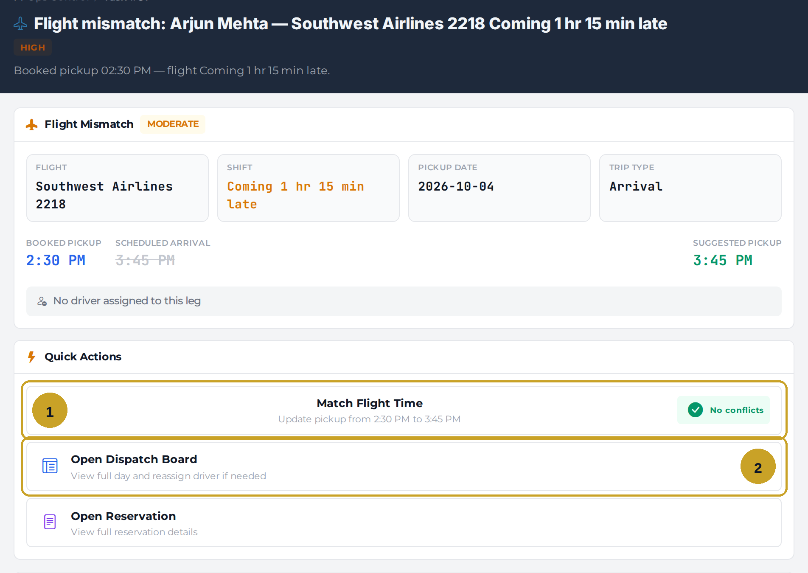

1. **Match Flight Time** moves the pickup to the new arrival. "No conflicts" means the driver's day still works afterwards.
2. **Open Dispatch Board** if the driver's day needs changing.

**Do this:** compare the booked pickup with the suggested one. Press Match Flight Time, or keep the pickup and Complete the task with a note saying why.

**Closes itself when** the gap drops under 30 minutes, which includes straight after Match Flight Time.

**Watch out:** Match Flight Time also closes every other open flight task on that trip, including Flight not found and cancelled ones.

### 5. Flight not found

Someone refreshed a flight and it doesn't exist, or doesn't land in Orlando. It is High, due in 4 hours. The line under the title names the number that failed.

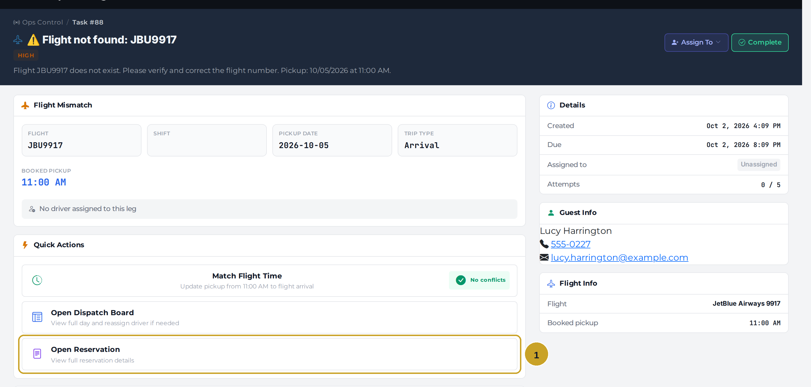

1. **Open Reservation** is where you correct the flight number.

**Do this:** call or text the guest (their number is under Guest Info) to confirm the airline and flight number. Correct it on the trip, then refresh the flight.

**Closes itself when** the flight is found and lands within 30 minutes of the pickup. Until then it stays in the list.

### 6. Flight cancelled or diverted

The flight refresh saw the guest's inbound flight cancelled or diverted. It is High and due straight away.

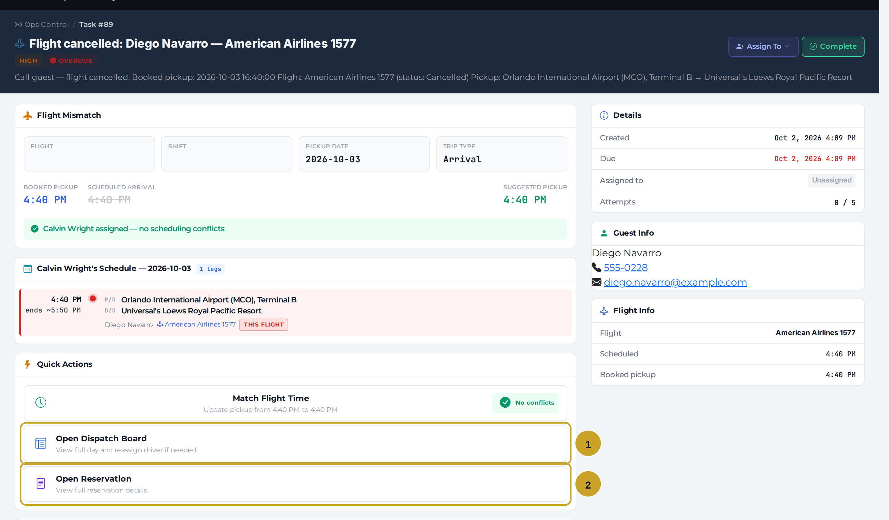

1. **Open Dispatch Board** to move or free the driver once you know the new plan.
2. **Open Reservation** to change the flight and the pickup time.

**Do this:** call the guest first and get their new flight. Update the trip's flight and pickup time, then sort out the driver on the board.

**Watch out:** this task can vanish on its own within seconds while the flight is still cancelled. Act on the flight, not the task: the schedule board marks the trip with a red ✕ CXL badge (DIV for diverted) whatever the task does.

### 7. Overnight date

An arrival between midnight and 6 AM, where nobody has confirmed which night the guest lands. Guests often book the wrong night. It comes in three versions:

- **Call to confirm overnight date** (Medium): the guest has no email, so call them.
- **Overnight date confirmation pending** (Low, or High if the date looks wrong): the guest was emailed a one-tap question. Call only if it's still open the day before pickup.
- **Overnight pickup, flight not found** (High): the flight can't be found either. Treat it like Flight not found.

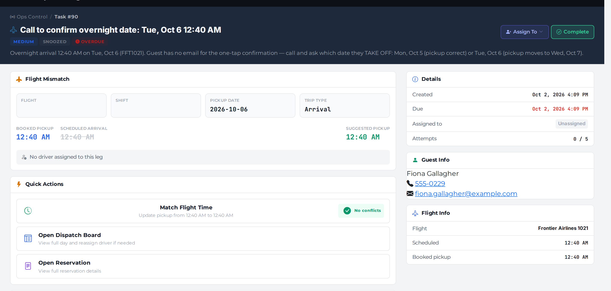

**Do this:** ask the guest which date their flight **takes off**. If it takes off the day before the pickup date, the booking is right. If it takes off on the pickup date, move the pickup to the next day.

**Watch out:** these can close themselves before anyone has confirmed. If you see one, confirm it anyway.

### 8. Confirmation Texts

One task a day, from 9 AM, while any of tomorrow's trips still needs its confirmation text. It is High, due 5 PM, and the title counts what's left.

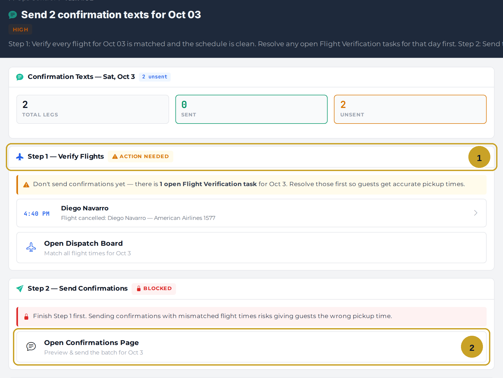

1. **Step 1 — Verify Flights** lists tomorrow's open flight tasks. Clear them first, so guests get the right pickup time. Step 2 stays blocked until then.
2. **Open Confirmations Page** to preview and send tomorrow's batch.

**Do this:** clear tomorrow's flight tasks, then send the batch from the Confirmations page.

**Closes itself when** every one of tomorrow's trips has had its text. A trip left out of the batch, or one that failed to send, keeps it open until the day after the trip.

### 9. Contact Us

Someone wrote in through the website's Contact Us form. Spam is filtered out first. It is High, due in 4 hours.

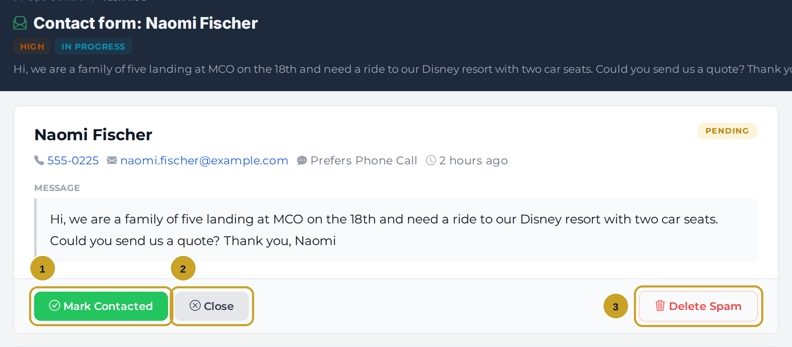

1. **Mark Contacted** once you've replied. This closes the task.
2. **Close** when there's nothing more to do, such as they booked or aren't interested. This closes it too.
3. **Delete Spam** only for junk. It deletes the message and the task, along with any calls logged on it.

**Do this:** reply the way they asked (the page shows their preference, such as "Prefers Phone Call"). Log each attempt, then press Mark Contacted.

**Closes itself when** the form is marked contacted or closed. Completing the task without that brings it back in about 2 hours.

### 10. After-Hours Fee

A pickup moved into 10 PM–6 AM, or the guest's flight now lands then, and the $20 isn't collected or already in the price. It is High and due straight away, so it shows LATE.

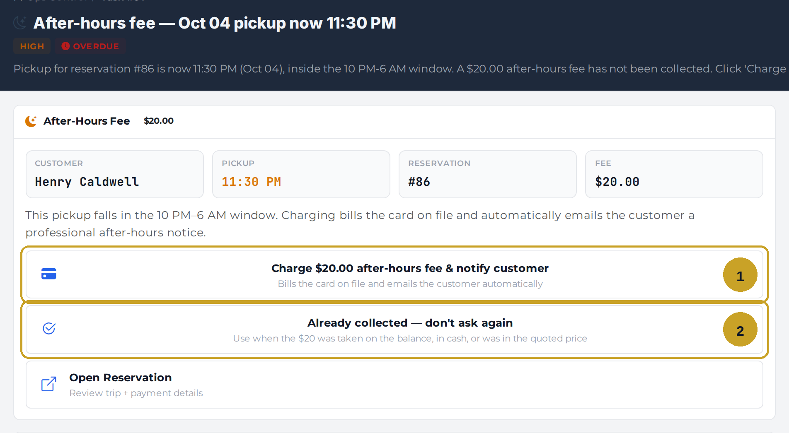

1. **Charge $20 after-hours fee & notify customer** bills the card on file and emails the guest. It only appears when there is a card on file.
2. **Already collected — don't ask again** is for when the $20 came in another way: on the balance, in cash, or inside a quoted price.

To **waive** it, press Complete on the task's row in Ops Control. That asks the money question, with all three answers:

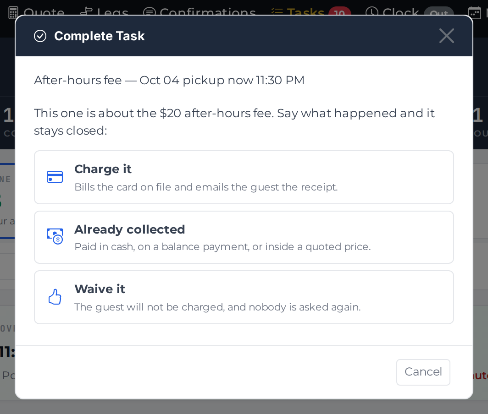

**Do this:** charge it, mark it already collected, or waive it. Each answer is recorded against the trip, so the question stops.

**Closes itself when** you answer, or the pickup moves back out of the window.

**Watch out:** if an answer says "already settled" but the task stays open, or a charge doesn't go through, Dismiss the task and tell a founder.

### 11. Manual Task

A follow-up someone wrote down: a call-back, a refund to chase, a driver to remind. The system files a few too, such as a card dispute from Stripe or a pre-pickup discount to apply. A manual task isn't linked to the trip, so it never closes on its own.

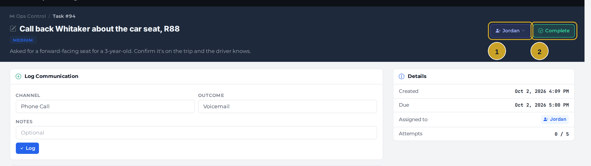

1. **Assign To** shows who owns it. Pick a teammate to hand it over.
2. **Complete** once it's done, with a note.

To create one, press **New Task** in Ops Control, or press **N**:

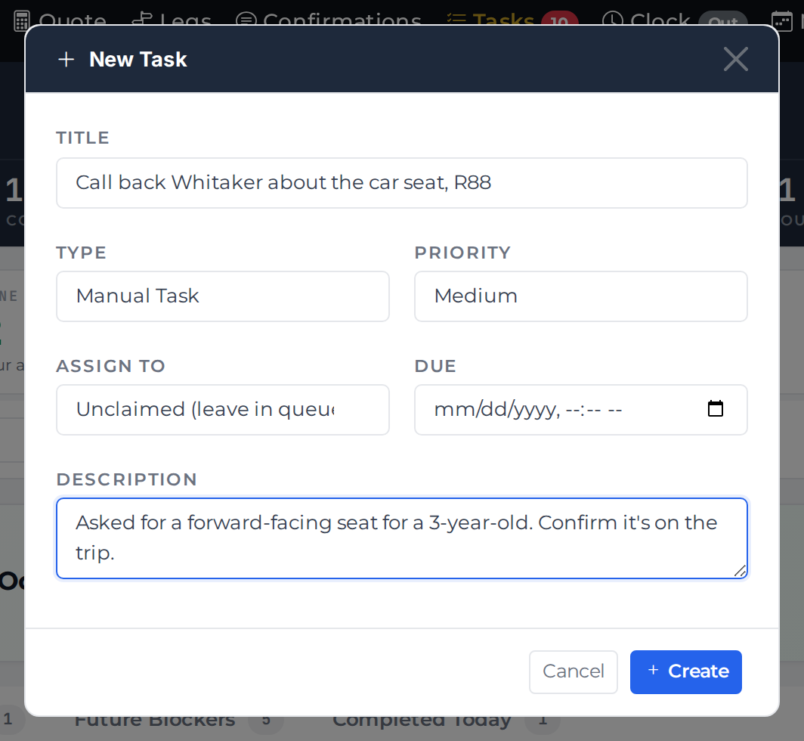

- **Title** (required): what needs doing, with the guest's name and the R-number from the trip's blue chip. The R-number makes it findable in search.
- **Type**: leave it on Manual Task.
- **Priority**: Medium, unless it's needed within hours.
- **Assign To**: leave it Unclaimed for anyone, or pick a teammate.
- **Due**: the real deadline. Left blank, it's 5 PM today, or 5 PM tomorrow once it's past 5.
- **Description**: what you know so far and what "done" looks like. Then press **Create**.

**Closes itself when:** never. Complete it yourself.

**Watch out:** discount and leads-board tasks open on an older quote page. Go by the task's title.

## Every shift

**Start of shift**

- [ ] Open **Tasks** and work **Mine** first: anything handed to you by name.
- [ ] Clear every **Critical** task in Unclaimed.
- [ ] Open **Tomorrow and later** at the bottom. Critical conflicts for tomorrow sit there.
- [ ] Check **Overdue**, and **Waiting** for anything due back during your shift.
- [ ] Look through **Future Blockers** for trips in the next 2 days.

**During the shift**

- [ ] Check Tasks at least every 30 minutes. New tasks arrive on that cycle, and nothing pings you. Press **R** to refresh.
- [ ] Keep every task you own claimed, snoozed to a real time, or closed.
- [ ] Log each call, text and email as you make it.
- [ ] When the Confirmation Texts task appears (from 9 AM), clear tomorrow's flight tasks, then send the batch.

**End of shift**

- [ ] Leave nothing in **Mine**: complete it, release it, or give it to the next dispatcher by name.
- [ ] On each task you hand over, log a note with the phone icon on its row: the last contact, its result and the next step.
- [ ] Tell the next dispatcher about any Critical task still open.
- [ ] Give anything only a founder can decide to a founder, and message them.
- [ ] If you're closing, finish **Close Shift** from the Shift menu.

## When something goes wrong

Nothing in Tasks pages anyone or reassigns anything on its own. The **Escalates in** timer and the **ESCALATED** tag are labels only. The one automatic change is an unpaid trip turning URGENT 2 hours before pickup. If a Critical task is stuck, a person has to raise it.

| Problem | What to do |
| --- | --- |
| A Critical task is open and you can't fix it | Call tonight's on-call person (My Schedule shows who) or a founder. Don't leave it sitting in the list. |
| A conflict shows red on the board but isn't in Tasks | It can take one or two 30-minute checks to be filed, and some never are. Fix it from the board; don't wait for the task. |
| You closed a task and it came back | Something changed (a time, the driver, the flight or the lateness), it was Dismissed instead of Completed, or the problem was never fixed. Treat it as new. |
| A new problem appears on a trip whose task just closed | The same kind of task can't be filed on that trip again for 2 hours after any close. Watch the board in the meantime. |
| You completed a real Driver Conflict or flight task by mistake | There is no Reopen button, and it stays hidden for up to 3 days with the board's red flag down. Fix the trip on the board now, and tell the next dispatcher. |
| A task is assigned to someone who's off | Give it to yourself or the right person, and let them know. |
| A task looks wrong: wrong flight, wrong driver, a cancelled trip | Check the trip first. If the task really is wrong, Dismiss it. If it keeps coming back, tell a founder. |
| The **Came back** count keeps climbing | Tell a founder. The system is re-filing work people have already closed. |
