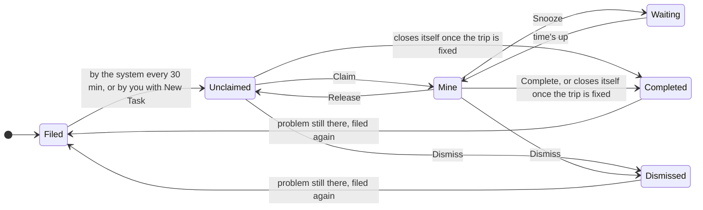

# SOP-005: Working the Tasks System (Ops Control)

**SOP:** SOP-005

**Audience:** All dispatchers and office staff

**Last updated:** October 2, 2026

Ops Control — the **Tasks** link in the top menu — is the team's shared work list. Every 30 minutes the system files a task for anything that needs a person: a driver who can't make a pickup, a trip with no driver, an unpaid booking, a moved flight. One dispatcher claims each task, fixes the real problem, and closes it. Nothing in Tasks texts, calls or moves a driver on its own.

**The #1 rule: fix the trip, not the task.** Assign the driver, take the payment, correct the flight — most tasks then close themselves, instantly or at the next 30-minute check. Press **Complete** only when the problem is handled, or when you have checked and the board is right as it stands. Say which in the note.

## Who does what

Ops Control is for office staff only; chauffeurs never see it.

| Who | Their part |
| --- | --- |
| The system, every 30 minutes | Files new tasks, closes tasks whose problem has gone away, and brings snoozed tasks back. It never texts, calls, reassigns or charges anyone. |
| Dispatcher on shift | Claims tasks, fixes the trip, logs every call, text and email on the task, and closes it with a note. Creates a manual task for any follow-up the system doesn't catch. |
| Next dispatcher | Picks up whatever the last shift released or assigned to them by name. |
| Founders | Use **Admin Tasks** (in the top menu) to assign, complete or cancel many tasks at once. Take the handoffs nobody on shift can decide: refunds, disputes, staffing. |

## How a task moves

Snoozed tasks come back on their own. A closed task is filed again only if the problem is still there; [Closing a task](#closing-a-task) says when.

## Reading Ops Control

The page opens on **Unclaimed**. The **Next up** card at the top always shows one task: your most urgent claimed task ("Finish this first"), or the most urgent unclaimed one.

| Lane | What's in it | Shortcut key |
| --- | --- | --- |
| Unclaimed | Open tasks nobody owns yet. Work comes from here. | 1 |
| Mine | Tasks you claimed or were assigned | 2 |
| Others | Tasks a teammate owns | — |
| Future Blockers | Open problems on trips after today. These also appear in the lanes above. | 3 |
| Waiting | Snoozed tasks, and tasks waiting on another open task | 4 |
| Completed Today | Everything closed today, newest first, with who closed it | 5 |

Inside each lane, tasks are grouped by priority:

| Band | What it asks of you | Usually due |
| --- | --- | --- |
| Critical (red) | Act now | The moment it's filed |
| High (orange) | Within a few hours | 4 hours |
| Medium (yellow) | Today | 8 hours |
| Low (grey) | When time permits | 24 hours |

A Critical task is due the moment it appears, so it shows **LATE** straight away. That is expected: it means now.

What else is on the page:

- **ACTIVE** means someone has claimed it. **SNOOZED until…** means it's parked. **WAITING ON** links it to another open task; that's a reminder only and blocks nothing.
- The phone count (e.g. 2/5) is how many calls, texts and emails have been logged on it.
- The blue **R-number · L-number** chip opens the reservation in a new tab, so you keep your place.
- Several Driver Conflicts for one driver on one day fold into a single row, with **Claim all** and **Complete all**. Complete all clears the tasks only; it changes nothing on the board.
- Driver Conflicts for tomorrow and later fold under **Tomorrow and later** at the bottom. Click **Show** to open them.
- **Came back** counts tasks the system filed again within a day of someone closing them, over the last 7 days. It should sit near zero. If it climbs, tell a founder.
- Search takes a name, a title, an R-number or an L-number. **N** opens a new task, **R** refreshes, **/** jumps to search.
- The red number on the **Tasks** link counts open tasks that aren't snoozed. It refreshes about once a minute.

## Working a task

1. **Start in Mine.** Finish what you already own before you claim more. The Next up card points at it.
2. **Then Unclaimed, top down.** Critical first, then whichever pickup is soonest.
3. **Open the task and the trip.** Click the title for the task page and the R-number chip for the reservation. Read the trip before you act.
4. **Claim it.** Press **Claim** on the row or on the Next up card. It moves to Mine with your name on it, so nobody doubles up. On a task page, pick yourself under **Assign To**.
5. **Fix the trip.** Assign or swap the driver, take the payment, correct the flight, call the guest. The task page lays out the recommended steps for its type, in order.
6. **Log every contact attempt.** Press the phone icon on the row, or use Log Communication on the task page. Pick the channel, the outcome, the number or email you used, and add a short note. Log voicemails and no-answers too — they tell the next person what has been tried.
7. **Close it the right way** — see the next section.

To take over a teammate's task, tell them first, then use the person icon on the row and pick yourself.

## Closing a task

Pick the button by what actually happened. Leave a note every time you Complete; it is saved on the task.

| What happened | Press | What happens next |
| --- | --- | --- |
| You fixed the trip | Usually nothing — the task closes itself. If it's still open, **Complete** and say what you did. | Done. |
| You checked, and the board is right as it stands | **Complete**, with a note saying why you're leaving it | A Driver Conflict or flight task stays closed for 3 days, unless a time, the driver or the flight changes. |
| You're waiting on someone | Log the attempt, then **Snooze**: 1 hour, 4 hours or tomorrow 9 AM | It sits in Waiting, then returns to the same person's Mine lane. Allow up to 30 minutes past the time. |
| You can't keep it | **Release**, or reassign it to a named teammate | It stays open with nothing lost. Release sends it back to Unclaimed. |
| The task is wrong: a test, a duplicate, spam | **Dismiss** (the X) | It's marked cancelled. No name or reason is saved. If the system still sees the problem, it files it again about 2 hours later. |

Two rules that catch people out:

- **Complete does not fix anything.** An unpaid booking, a trip with no driver or an uncontacted form comes back about 2 hours after you close it, for as long as the problem is still there. Take the payment, assign the driver, mark the form contacted.
- **An After-Hours Fee task can't be closed blank.** Complete asks the money question instead: **Charge it**, **Already collected** or **Waive it**. Each answer settles that trip for good.

## Task types

Every task page lays out its recommended steps in order. This table is the short version.

| Task | Filed when | What you do | Closes itself when |
| --- | --- | --- | --- |
| **Driver Conflict** | An in-house driver can't reach a pickup by its deadline. For an airport arrival, that's inside by gate time + 10 minutes. Critical for today and the next 2 days, High after that. | Follow the page: 1. match the flight time, or watch the earlier job. 2. Cover in-house with a free driver. 3. Farm out, as a last resort. Call or text the driver from the page. | The driver changes, either trip finishes or is cancelled, or the next check finds no conflict |
| **Driver Assignment** ("No driver: …") | A trip today has no driver and its pickup hasn't passed. Critical. | Assign a driver from the task page or the dispatch board. Farm out if nobody fits. | A driver is assigned, or the pickup time passes |
| **Unpaid Reservations** | A confirmed booking still owes money, its next trip is within 3 days, and it was booked over 12 hours ago. A saved card counts as paid. Critical on the day, High 1–2 days out, Medium at 3. | Call first — **What to say** gives you the opening. Then text, then email. Take payment or cancel the trip. Still unpaid 2 hours before pickup, it turns **URGENT**. Nothing cancels it for you. | Payment lands, a card is saved, the trip is cancelled, or the trip date passes |
| **Flight Verification** — "Flight mismatch" | An arrival in the next 7 days now lands 30+ minutes from the booked pickup. The bigger the move and the sooner the trip, the higher the priority. | Check the new time. **Match Flight Time**, or keep the pickup and Complete with a note saying why. | The gap drops under 30 minutes |
| **Flight Verification** — "Flight not found" | The flight number doesn't exist. High, due in 4 hours. | Confirm the number with the guest and correct it on the trip. | The flight is found |
| **Flight Verification** — "Flight cancelled" or "diverted" | A refreshed inbound flight shows cancelled or diverted. High. | Call the guest. Rebook the pickup time and the driver. | Don't wait for it: act on the flight, not the task |
| **Flight Verification** — overnight date | An after-midnight pickup where nobody has confirmed which night the guest lands | Call the guest and confirm the date. | The date is confirmed |
| **Confirmation Texts** ("Send 12 confirmation texts for …") | From 9 AM daily, while any of tomorrow's trips still needs its text. High, due 5 PM. | First clear tomorrow's flight tasks. Then send the batch from the Confirmations page. | Every trip tomorrow has had its text sent |
| **Contact Us** | A website Contact Us message is waiting. Spam is skipped. High, due in 4 hours. | Call, then text, then email. Then press **Mark Contacted**, **Close** or **Delete Spam** on the task page. | The form is marked contacted or closed |
| **After-Hours Fee** | A pickup moves into 10 PM–6 AM and the $20 isn't collected or already in the price. High. | Answer **Charge it**, **Already collected** or **Waive it**. No card on file? Take payment your usual way, then pick Already collected. | You answer, or the pickup moves back out of the window |
| **Manual Task** | A person creates it. The system also files one for a card dispute, a pre-pickup discount to apply, or a leads-board follow-up. | Whatever the title and description say. | Never — Complete it yourself |

No longer filed: **Tight Turn** (the orange gap on the board is the watch signal now), **QUOTE NEEDED** (quote requests are answered in GoHighLevel) and **Possible duplicate** (use the Duplicate Reservations page).

## Creating a manual task

Create one whenever a real follow-up has no automatic task: a guest promised to call back, a refund to chase, a driver to remind. Never keep it only in your own notes.

1. Press **New Task** at the top right, or press **N**.
2. **Title** (required): what needs doing, with the guest's name and R-number — "Call back Smith about the car seat, R12345". The R-number is what makes it show up in search.
3. **Type**: leave it on Manual Task. Pick another type only to file it under that heading, such as Unpaid Reservations for a one-off payment reminder.
4. **Priority**: Medium, unless it's needed within hours.
5. **Assign To**: leave it Unclaimed for anyone to grab, or pick a teammate.
6. **Due**: set the real deadline. Left blank, it's due at 5 PM today, or 5 PM tomorrow once it's past 5.
7. **Description**: what you know so far and what "done" looks like. Press **Create**.

A manual task isn't linked to the reservation, so it never closes itself. Complete it when the follow-up is done.

## Every shift

**Start of shift**

- [ ] Open **Tasks** and work **Mine** first — anything handed to you by name.
- [ ] Clear every **Critical** task in Unclaimed, soonest pickup first.
- [ ] Check **Overdue**, and **Waiting** for anything due back during your shift.
- [ ] Look through **Future Blockers** for trips in the next 2 days.

**During the shift**

- [ ] Check Tasks at least every 30 minutes. New tasks arrive on that cycle, and nothing pings you. Press **R** to refresh.
- [ ] Keep every task you own claimed, snoozed to a real time, or closed.
- [ ] Log each call, text and email as you make it.
- [ ] When the Confirmation Texts task appears (from 9 AM), clear tomorrow's flight tasks, then send the batch.

**End of shift**

- [ ] Leave nothing in **Mine**: complete it, release it, or assign it to the next dispatcher by name.
- [ ] On each task you hand over, use Log Communication to note the last contact, its result and the next step.
- [ ] Tell the next dispatcher about any Critical task still open.
- [ ] Assign anything only a founder can decide to a founder, and message them.
- [ ] Then finish **Close Shift** from the Shift menu as usual.

## When something goes wrong

Nothing in Tasks escalates or alerts anyone on its own. The **Escalates in** timer on some task pages is a countdown only: nobody is paged, and nothing is reassigned when it runs out. If a Critical task is stuck, a person has to raise it.

| Problem | What to do |
| --- | --- |
| A Critical task is open and you can't fix it | Call the on-call person (My Schedule shows who) or a founder. Don't leave it sitting in the list. |
| A conflict shows red on the board but isn't in Tasks | Pickup more than 2 hours away: it's filed at the next 30-minute check, if it's still there. Inside 2 hours: it's filed straight away. Either way, fix it from the board — don't wait for the task. |
| You closed a task and it came back | Something changed (a time, the driver or the flight), it was Dismissed instead of Completed, or the problem was never fixed. Treat it as new. |
| You completed a real Driver Conflict or flight task by mistake | There is no Reopen button, and it stays hidden for up to 3 days. Fix the trip on the board now, and tell the next dispatcher. |
| A task is assigned to someone who's off | Reassign it to yourself or the right person, and let them know. |
| A task looks wrong: wrong flight, wrong driver, a cancelled trip | Check the trip first. If the task really is wrong, Dismiss it. If it keeps coming back, tell a founder. |
| The **Came back** count keeps climbing | Tell a founder. The system is re-filing work people have already closed. |
